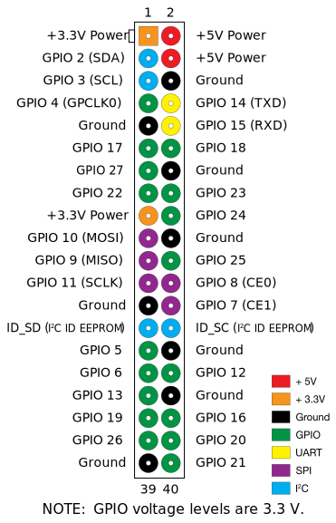

# Setup

This file is to setup the Rasperry PI. Hardware:

 - Raspberry PI 1B
 - TFT screen controller: ILI9341
 - Touchscreen controller: XPT2046 (Linux driver: ADS7846)

## Wiring

The GPIOs are the ones in `/sys/class/gpio/` ([source](https://elinux.org/RPi_Low-level_peripherals#General_Purpose_Input.2FOutput_.28GPIO.29)).



| TFT      | PI (SPI0.0)           |
|----------|-----------------------|
| LED      | Pin12 (GPIO18)        |
| SCK      | Pin23 (GPIO11) = SCLK |
| MOSI     | Pin19 (GPIO10) = MOSI |
| DC       | Pin18 (GPIO24)        |
| RESET    | Pin22 (GPIO25)        |
| CS       | Pin24 (GPIO8) = CE0   |
| GND      | Pin25 (GND)           |
| VCC      | Pin17 (3.3V)          |

| Touch    | PI (SPI0.1)           |
|----------|-----------------------|
| T_IRQ    | Pin11 (GPIO17)        |
| T_DO     | Pin21 (GPIO9) = MISO  |
| T_DIN    | Pin19 (GPIO10) = MOSI |
| T_CS     | Pin26 (GPIO7) = CE1   |
| T_CLK    | Pin23 (GPIO11) = SCLK |

## Commands

### Rights

```bash
# rights to read from /dev/input/event*
$ sudo usermod -a -G input $USER
```

### Enable the TFT framebuffer

```bash
# as root
$ echo "dtparam=spi=on" >> /boot/config.txt
$ echo "fbtft_device" >| /etc/modules-load.d/fbtft_device.conf
$ echo "options fbtft_device name=fb_ili9341 gpios=reset:25,dc:24,led:18 speed=64000000 txbuflen=32768 custom=1 rotate=90 fps=20 bgr=0" >| /etc/modprobe.d/fbtft.conf
$ systemctl disable getty@tty1.service
```

### Enable the touchscreen

```bash
# as root
$ echo "dtoverlay=ads7846,penirq=17,speed=100000,penirq_pull=2,xohms=80,swapxy=1" >> /boot/config.txt
```
